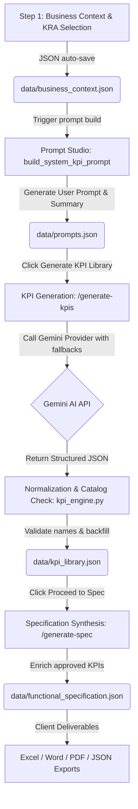

# KPI Transformation & Analytics Copilot
---

## 1. Technical Stack

The application is structured as a decoupled client-server architecture:

### Backend (FastAPI Services)
* **Framework**: [FastAPI](https://fastapi.tiangolo.com/) (Python 3.11+) for high-performance, asynchronous REST APIs.
* **Validation**: [Pydantic v2](https://docs.pydantic.dev/) for strict type validation, request/response schema parsing, and database models.
* **LLM Engine**: Direct HTTP request integration with Google Gemini Developer API (utilizing `gemini-2.5-flash`, `gemini-2.5-flash-lite`, `gemini-flash-latest`, and `gemini-2.0-flash-lite` models in sequence).
* **Fuzzy Matching**: `difflib.SequenceMatcher` for catalog-conformity verification.
* **Document Synthesis**: `python-docx` for Word (.docx) generation, `reportlab` for PDF printing, and `openpyxl` for exporting Excel (.xlsx) workbooks.
* **Persistence**: Flat-file JSON database files stored locally in `/data`.

### Frontend (React Consulting Interface)
* **Framework**: [React 19](https://react.dev/) with [TypeScript](https://www.typescriptlang.org/) for typed state safety.
* **Bundler**: [Vite](https://vite.dev/) for fast hot-module replacement and optimized asset building.
* **Styling**: Tailwind CSS configured with a sleek, premium dark theme matching professional consulting palettes:
  * Theme Accents: Solid Accent Yellow (`#FFE600`), Dark BG (`#111111`), Cards BG (`#1B1B1B`), Border Borders (`#303030`), Light Gray Gray (`#F5F5F5`).
* **Icons**: [Lucide React](https://lucide.dev/) for vector iconography.
* **Routing**: [React Router DOM v6](https://reactrouter.com/) for page state changes.

---

## 2. Project Architecture & Lifecycle Workflow

Below is the workflow mapping strategic context intake to final spec deliverables:



---

## 3. Backend Architecture & Code Deep Dive

The backend lives in the `backend/` directory.

### A. Data Schemas & Validation ([models.py](file:///Users/riddhiranjan/Downloads/kpi/backend/app/models.py))
FastAPI routes enforce type checks using Pydantic models. Key models include:

```python
class BusinessContext(BaseModel):
    industry: str = ""
    organization_level: str = ""
    kpi_count: int = Field(default=8, ge=1, le=50)
    business_priorities: list[str] = Field(default_factory=list)
    business_challenges: list[str] = Field(default_factory=list)
    top_kras: list[str] = Field(default_factory=list)
    functional_areas: list[str] = Field(default_factory=list)
    updated_at: datetime = Field(default_factory=datetime.utcnow)
```
The Pydantic fields constrain requests: `kpi_count` has range validation (`ge=1`, `le=50`), which ensures the prompt length remains safe for LLM ingestion context windows.

---

### B. Gemini API Integration & Model Fallback ([llm_providers.py](file:///Users/riddhiranjan/Downloads/kpi/backend/app/services/llm_providers.py))
`GeminiProvider` executes asynchronous POST requests to the Google Gemini API. It implements a **Model Fallback Sequence** to automatically retry requests with alternative models in the event of `503 Service Unavailable` or quota (429) errors:

```python
class GeminiProvider(LLMProvider):
    name = "gemini"

    def __init__(self) -> None:
        self.api_key = os.getenv("GEMINI_API_KEY", "")
        self.model = os.getenv("GEMINI_MODEL", "gemini-2.5-flash")

    async def generate_json(self, system: str, prompt: str) -> dict[str, Any]:
        if not self.api_key:
            raise RuntimeError("GEMINI_API_KEY is not configured.")
        
        # Sequenced models to try if the primary model fails or is overloaded
        models_to_try = [self.model]
        fallbacks = ["gemini-2.5-flash-lite", "gemini-flash-latest", "gemini-2.0-flash-lite"]
        for f in fallbacks:
            if f not in models_to_try:
                models_to_try.append(f)
                
        last_exception = None
        for attempt_model in models_to_try:
            url = f"https://generativelanguage.googleapis.com/v1beta/models/{attempt_model}:generateContent"
            try:
                async with httpx.AsyncClient(timeout=60) as client:
                    response = await client.post(
                        url,
                        params={"key": self.api_key},
                        json={
                            "systemInstruction": {"parts": [{"text": system}]},
                            "contents": [{"role": "user", "parts": [{"text": prompt}]}],
                            "generationConfig": {
                                "responseMimeType": "application/json",
                                "temperature": 0.2,
                            },
                        },
                    )
                    response.raise_for_status()
                text = response.json()["candidates"][0]["content"]["parts"][0]["text"]
                return json.loads(text)
            except Exception as exc:
                last_exception = exc
                print(f"GeminiProvider: Model '{attempt_model}' call failed: {exc}. Trying next model...")
                
        if last_exception:
            raise last_exception
```
This fails over to `gemini-2.5-flash-lite` or `gemini-flash-latest` dynamically, preventing failures when Google's experimental models experience demand spikes.

---

### C. Normalization & Selection Engine ([kpi_engine.py](file:///Users/riddhiranjan/Downloads/kpi/backend/app/services/kpi_engine.py))
To prevent AI hallucination of KPI names, the engine matches LLM outputs against a curated catalog of standard enterprise metrics (`kpi_catalog.json`):

1. **Filtering & Scoring**:
   Only KPIs from selected functional areas are processed. The system scores each metric against the context:
   * **Industry Match**: 30% weight
   * **Functional Area Match**: 30% weight
   * **KRA Match**: 20% weight
   * **Priority Match**: 10% weight
   * **Challenge Match**: 10% weight

2. **Name Verification**:
   Uses fuzzy string comparison (`difflib.SequenceMatcher(None, raw_name, catalog_name).ratio()`) to check LLM outputs:
   ```python
   # Fuzzy matching logic
   ratio = SequenceMatcher(None, raw_name.lower(), cat_item["kpi_name"].lower()).ratio()
   if ratio > 0.90:
       best_match = cat_item
   ```
   If a match is found, the metric name is normalized. If no match is found, the generated item is discarded and replaced with the next highest-scoring item from the catalog to ensure complete catalog alignment.

---

### D. Prompt Engineering Security Boundary ([prompting.py](file:///Users/riddhiranjan/Downloads/kpi/backend/app/services/prompting.py))
The Prompt Studio hides technical logic from the end-user by dividing prompt structures:
1. **User-Facing Prompt** (`build_kpi_prompt`): Contains only clean, business-readable parameters (industry context, priorities, top KRAs, functional scope).
2. **Backend System Instruction** (`build_system_kpi_prompt`): Appends the full curated KPI JSON catalog, selection weights, validation schema constraints, and format requirements. This ensures the output is always structural JSON, leaving the user with a clean business consulting view.

---

## 4. REST API Endpoint Specifications

FastAPI exposes routes via HTTP interfaces:

### `POST /business-context`
Saves the context data input from Step 1.
* **Request Body**: `BusinessContext` JSON payload.
* **Behavior**: Validates keys against constraints, appends timestamps, and saves data to `data/business_context.json`.

### `POST /generate-prompt`
Synthesizes the prompt studio record.
* **Response**: `PromptRecord` (User prompt text, summary text).
* **Behavior**: Reads business context and generates a clean prompt. It runs a lightweight LLM call to generate a Live AI summary of the scope.

### `POST /generate-kpis`
Generates the core metrics library.
* **Response**: `KPILibrary` (KPI definitions list, quality diagnostics, recommendations, and executive summaries).
* **Behavior**: Passes System and User prompts to the `GeminiProvider`. Normalizes results against `kpi_catalog.json` and writes outputs to `data/kpi_library.json`.

### `POST /approve-kpis`
Approves selected KPIs in the review table.
* **Request Body**: `{"ids": ["kpi-1", "kpi-2"], "status": "approved"}`
* **Behavior**: Moves the selected items to `data/approved_kpi_library.json`, making them available for Step 3 (Functional Specification).

### `POST /generate-spec`
Generates the functional specification document.
* **Response**: `FunctionalSpecification` items.
* **Behavior**: Enriches approved metrics with detailed calculations, source parameters, assumptions, and reporting rules.

---

## 5. Frontend Architecture & Custom Component Styling

The frontend lives in the `frontend/` directory.

### A. Responsive Core Shell ([Shell.tsx](file:///Users/riddhiranjan/Downloads/kpi/frontend/src/components/Shell.tsx))
Provides the main application frame containing:
* **Header Branding**: Contains the EY vector logo slash, bold white text, and the tagline:
  ```tsx
  <NavLink to="/" className="flex items-center gap-4">
    <div className="flex items-center gap-3">
      <div className="flex flex-col">
        <svg className="w-16 h-3" viewBox="0 0 80 16">
          <polygon points="0,14 80,0 80,6" fill="#FFE600" />
        </svg>
        <span className="text-3xl font-black leading-none text-white tracking-tighter -mt-1 font-sans">EY</span>
      </div>
      <div className="flex flex-col text-[9px] uppercase tracking-wider font-semibold text-white/85 leading-tight border-l border-white/25 pl-3">
        <span>Shape the future</span>
        <span>with confidence</span>
      </div>
    </div>
    <div className="h-8 w-px bg-[#303030] mx-1" />
    <h1 className="text-lg font-semibold tracking-tight text-[#F5F5F5]">KPI Transformation & Analytics Copilot</h1>
  </NavLink>
  ```
* **Sidebar Menu**: Displays the 7 workflow steps. Active/hover items show a custom dark background block (`bg-[#111111]`), yellow text (`text-[#FFE600]`), and a thick yellow bottom underline highlight (`border-b-[#FFE600]`) to align with EY consulting layouts.

### B. Custom Option Inputs ([MultiSelect.tsx](file:///Users/riddhiranjan/Downloads/kpi/frontend/src/components/MultiSelect.tsx))
Replaces standard dropdown selectors with interactive grids:
```tsx
<button
  key={option}
  type="button"
  className={`px-3 py-2 text-left text-xs font-semibold tracking-wide transition border-t border-l border-r border-b-4 border-[#303030] ${
    selected 
      ? "bg-[#111111] text-[#FFE600] border-b-[#FFE600]" 
      : "border-b-[#303030]/40 bg-[#1B1B1B] text-[#F5F5F5] hover:bg-[#111111] hover:text-[#FFE600] hover:border-b-[#FFE600]"
  }`}
  onClick={() => toggle(option)}
>
  {option}
</button>
```
Using `border-b-4` pre-allocates padding to eliminate vertical layout jumps or elements shifting when active/hover states trigger.

### C. Read-Only Side Drawer ([KpiLibrary.tsx](file:///Users/riddhiranjan/Downloads/kpi/frontend/src/components/KpiLibrary.tsx))
Opening a row inside the KPI library renders a side sheet drawer:
* Displays exactly the 13 required metrics fields (Name, Area, KRA, Business Purpose, Formula, Numerator/Denominator, Source, Owners, Cadence, Targets, and Assumptions).
* Fully read-only structure in compliance with governance guidelines. Includes quick-actions in the footer for single metric *Approve* or *Reject*.

---

## 6. How to Run Locally

### Backend Setup
1. Enter the directory and create a virtual environment:
   ```bash
   cd backend
   python3 -m venv venv
   source venv/bin/activate
   ```
2. Install dependencies:
   ```bash
   pip install -r requirements.txt
   ```
3. Set your Gemini API key in `backend/.env` (or configure via CLI):
   ```bash
   GEMINI_API_KEY=your_gemini_api_key uvicorn app.main:app --reload --port 8000
   ```

### Frontend Setup
1. Enter the directory and install Node dependencies:
   ```bash
   cd frontend
   npm install
   ```
2. Start the Vite development hot reload server:
   ```bash
   npm run dev
   ```
3. Open `http://localhost:5173` in your browser.
